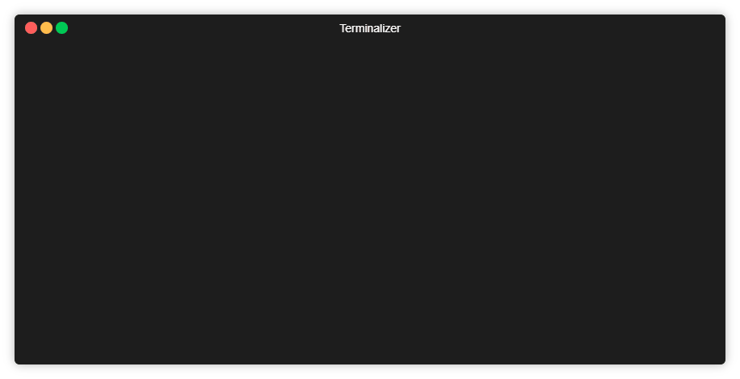

# PDFJoin

This commandline-tool allows you to quickly merge multiple
PDF files into one.

It searches the current work directory and all subdirectories 
recursively for PDF files and lists them to you. You can then
select and deselect files that you want and rearrange them.

After that, you can specify the outputname and PDFJoin does
the rest for you.

To get started, you need NodeJS and Java v6+ installed.

You can call the app in the directory in which you want to search
for PDF files directly with 

    $ npx pdfjoin
     
without installing anything, or you can install it globally and 
invoke it from there:

    $ npm i -g pdfjoin
    $ pdfjoin

